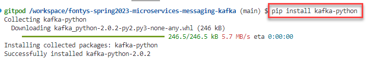
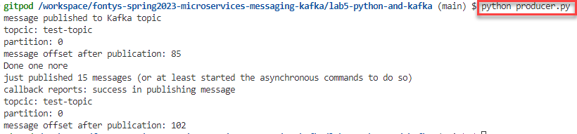

# Lab - Programmatic interaction with Apache Kafka from Python

- [Lab - Programmatic interaction with Apache Kafka from Python](#lab---programmatic-interaction-with-apache-kafka-from-python)
  - [Python interacting with Apache Kafka](#python-interacting-with-apache-kafka)
    - [Producing to test-topic in Node](#producing-to-test-topic-in-node)

In the lab 3, you have produced and consumed messages from Node. In this lab, you will also produce and consume messages in a programmatic way, from Python this time. You will use the Apache Kafka platform that you used in earlier labs as well as the Python run time environment that is also part of the Gitpod workspace. 

## Python interacting with Apache Kafka

As with most languages, multiple libraries are available to interact with Kafka. One that stands out in the world of Python is `kafka-python` - as stated "Python client for the Apache Kafka distributed stream processing system. kafka-python is designed to function much like the official java client, with a sprinkling of pythonic interfaces " (and more than 5K stars on GitHub). See [Homepage](https://pypi.org/project/kafka-python/). 

The sources for this part of the lab are in the directory *lab5-python-and-kafka* directory.

### Producing to test-topic in Node

Open a fresh bash terminal and navigate to directory `lab5-python-and-kafka`.

```
cd lab5-python-and-kafka
```

To install the Python library `kafka-python` execute:

```
pip install kafka-python
```



Next, look at the code in Python program `lab5-python-and-kafka/producer.py`. This program import kafka from KafkaProducer - available because we pip-installed `kafka-python`. The producer is configured with the Kafka brokers. Sending a message to a topic with this library is an asynchronous operation. Calling send on the producer does not mean that the message is published - but a background process is started to handle that action. A `future` is returned - to have handle on how the background action is proceeding. The call to *get* on the future blocks the main thread to wait for the result of the future to be available (similar to `await` in Node programs).

The result of the future is some meta information about the interaction with Kafka, such as the partition to which the message has been published by Kafka and the message offset on that partition after adding this message.

If we do not care about the result of message publication, we do not need to inspect or even store the future, as is done for the second message.

Note that we have to turn the message into `bytes` when we publish them to Kafka. Kafka only handles bytes - no strings or other fancy objects.

To execute the producer, run (in the terminal in directory `lab5-python-and-kafka` ):

```
python producer.py
```
The result should look - with different message offset values - like this:



