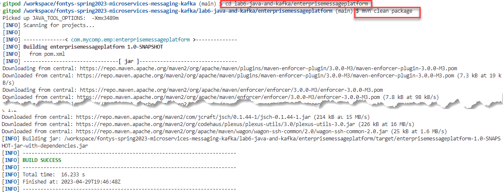
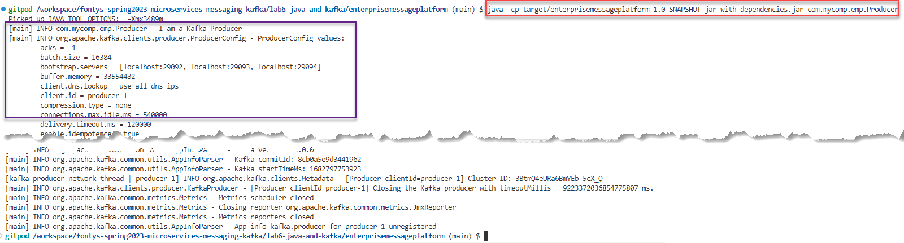
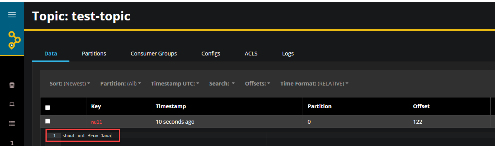
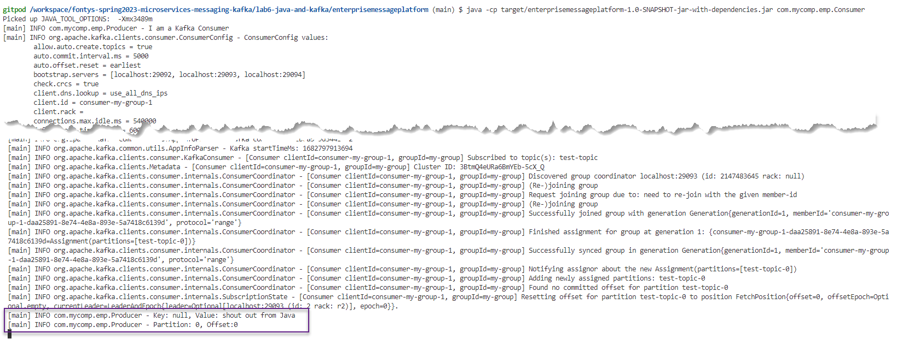

# Lab - Programmatic interaction with Apache Kafka from Java

- [Lab - Programmatic interaction with Apache Kafka from Java](#lab---programmatic-interaction-with-apache-kafka-from-java)
  - [Java interacting with Apache Kafka](#java-interacting-with-apache-kafka)
    - [Producing to test-topic in Java](#producing-to-test-topic-in-java)
    - [Consuming from test-topic in Java](#consuming-from-test-topic-in-java)
    - [Resources](#resources)

In the labs 3 and 5, you have produced and consumed messages from Node and Python respectively. In this lab, you will also produce and consume messages in a programmatic way, from Java this time. You will use the Apache Kafka platform that you used in earlier labs as well as the Java run time environment that is also part of the Gitpod workspace. 

## Java interacting with Apache Kafka

Apache Kafka itself is written in Java and Scala and it runs on JVMs. Kafka's native API was written in Java as well. Interacting from Java with Apache Kafka is therefore quite straightforward. Typically the Apache Kafka Client [Maven Artifact org.apache.kafka/kafka-clients ](https://mvnrepository.com/artifact/org.apache.kafka/kafka-clients) is used with Java applications to produce and consume messages (and manage brokers, topics and partitions). In this lab, you will see simple Java programs that produce and consume messages.

The sources for this part of the lab are in the directory *lab6-java-and-kafka* directory.
### Producing to test-topic in Java

The Java source file `lab6-java-and-kafka/enterprisemessageplatform/src/main/java/com/mycomp/emp/Producer.java` contains a Class Producer with a `main` method. This Class is about the simplest Java message producer you could think of. It imports a number of classes. 

```
import org.apache.kafka.clients.producer.KafkaProducer;
import org.apache.kafka.clients.producer.ProducerConfig;
import org.apache.kafka.clients.producer.ProducerRecord;
import org.apache.kafka.common.serialization.StringSerializer;
import org.slf4j.Logger;
import org.slf4j.LoggerFactory;
```

To make these classes available to the application, the corresponding libraries need to be associated with the application. This is done through entries in the `pom.xml` file:

```
  <dependencies>
        <dependency>
            <groupId>org.apache.kafka</groupId>
            <artifactId>kafka-clients</artifactId>
            <version>3.0.0</version>
        </dependency>
        <dependency>
            <groupId>org.slf4j</groupId>
            <artifactId>slf4j-api</artifactId>
            <version>1.7.32</version>
        </dependency>
        <dependency>
            <groupId>org.slf4j</groupId>
            <artifactId>slf4j-simple</artifactId>
            <version>1.7.32</version>
        </dependency>
        ...
```

When the application is first built, all jar files that make up these artifacts and their dependencies are downloaded into the Gitpod workspace.

In the main method, the steps are straightforward:
* create the KafkaProducer - with the end points for the brokers (through the bootstrap servers property)
* prepare the message to produce
* send the (instruction for producing) the message to the topic (the actual interaction with the Kafka broker is done asynchronously)
* flush all remaining messages (synchronize all pending background actions)
* close the producer (connection)

In code:

```
public static void main(String[] args) {
        String bootstrapServers = "localhost:29092,localhost:29093,localhost:29094";
        // create Producer properties
        Properties properties = new Properties();
        properties.setProperty(ProducerConfig.BOOTSTRAP_SERVERS_CONFIG, bootstrapServers);
        properties.setProperty(ProducerConfig.KEY_SERIALIZER_CLASS_CONFIG, StringSerializer.class.getName());
        properties.setProperty(ProducerConfig.VALUE_SERIALIZER_CLASS_CONFIG, StringSerializer.class.getName());
        // create the producer
        KafkaProducer<String, String> producer = new KafkaProducer<>(properties);

        // create a producer record
        ProducerRecord<String, String> producerRecord =
                new ProducerRecord<>(topic, message);

        // send data - asynchronous
        producer.send(producerRecord);

        // flush data - synchronous
        producer.flush();
        // flush and close producer
        producer.close();
```        

Let's build and execute this Java program. Open a Bash terminal and navigate to directory `lab6-java-and-kafka/enterprisemessageplatform`

Then build the Maven project using:

```
mvn clean package
```


This command builds the Fat JAR file: `lab6-java-and-kafka/enterprisemessageplatform/target/enterprisemessageplatform-1.0-SNAPSHOT-jar-with-dependencies.jar` that contains all dependencies for the Kafka producer (and consumer).

To run the message producer, execute this command (from directory `lab6-java-and-kafka/enterprisemessageplatform`):

```
java -cp target/enterprisemessageplatform-1.0-SNAPSHOT-jar-with-dependencies.jar com.mycomp.emp.Producer
```

The logging tells you what is happening: the producer reports for duty, sets up the producer, sends a message and finishes.


You can check the results on the Kafka Topic, for example in the AQHK browser window. Or in the next section where we will consume from Kafka Topic in a Java application.


### Consuming from test-topic in Java

The Java source file `lab6-java-and-kafka/enterprisemessageplatform/src/main/java/com/mycomp/emp/Producer.java` contains a Class Producer with a `main` method. This Class is about the simplest Java message producer you could think of. It imports a number of classes. 

```
import org.apache.kafka.clients.consumer.ConsumerConfig;
import org.apache.kafka.clients.consumer.ConsumerRecord;
import org.apache.kafka.clients.consumer.ConsumerRecords;
import org.apache.kafka.clients.consumer.KafkaConsumer;
import org.apache.kafka.common.serialization.StringDeserializer;
```

These classes are already available to the application thanks to the entries in the `pom.xml` file that we discussed a while back.

In the main method, the steps are straightforward:
* create the KafkaConsumer - with the end points for the brokers (through the bootstrap servers property) and a random consumer group identifier; indicate that we want all messages, from the very oldest still available (`earliest`)
* subscribe the consumer to the test-topic
* start polling the topic for new messages
* process the consumed messages: log information about the message including the actual contents
* this program does not stop by itself - it runs until you forcibly end it

In code:

```
    public static void main(String[] args) {
        log.info("I am a Kafka Consumer");

        String bootstrapServers = "localhost:29092,localhost:29093,localhost:29094";
        String groupId = "my-group";
        String topic = "test-topic";

        // create consumer configs
        Properties properties = new Properties();
        properties.setProperty(ConsumerConfig.BOOTSTRAP_SERVERS_CONFIG, bootstrapServers);
        properties.setProperty(ConsumerConfig.KEY_DESERIALIZER_CLASS_CONFIG, StringDeserializer.class.getName());
        properties.setProperty(ConsumerConfig.VALUE_DESERIALIZER_CLASS_CONFIG, StringDeserializer.class.getName());
        properties.setProperty(ConsumerConfig.GROUP_ID_CONFIG, groupId);
        properties.setProperty(ConsumerConfig.AUTO_OFFSET_RESET_CONFIG, "earliest");

        try (// create consumer
        KafkaConsumer<String, String> consumer = new KafkaConsumer<>(properties)) {
            // subscribe consumer to our topic(s)
            consumer.subscribe(Arrays.asList(topic));
            // poll for new data
            while (true) {
                ConsumerRecords<String, String> records = consumer.poll(Duration.ofMillis(100));

                for (ConsumerRecord<String, String> record : records) {
                    log.info("Key: " + record.key() + ", Value: " + record.value());
                    log.info("Partition: " + record.partition() + ", Offset:" + record.offset());
                }
            }
        }
    }
```        

The code is already build and packaged. To run it: open a Bash terminal and navigate to directory `lab6-java-and-kafka/enterprisemessageplatform`

To run the message consumer, execute this command (from directory `lab6-java-and-kafka/enterprisemessageplatform`):

```
java -cp target/enterprisemessageplatform-1.0-SNAPSHOT-jar-with-dependencies.jar com.mycomp.emp.Consumer
```


### Resources

A nice step by step [tutorial on working with Apache Kafka from Java](https://www.conduktor.io/kafka/java-kafka-programming/) 

Introduction: [How to build a fat jar (with all dependencies) using Maven](https://jenkov.com/tutorials/maven/maven-build-fat-jar.html)

See an [overview of Kafka Client Libraries for many different programming languages](https://cwiki.apache.org/confluence/display/KAFKA/Clients)