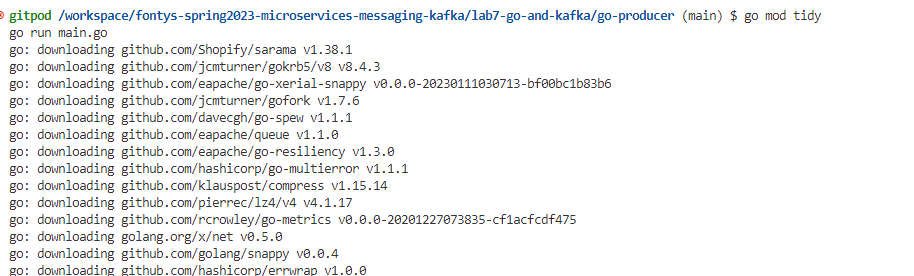
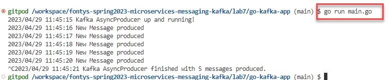
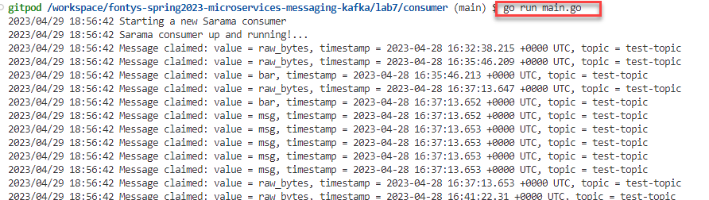

# Lab - Programmatic interaction with Apache Kafka from Go

- [Lab - Programmatic interaction with Apache Kafka from Go](#lab---programmatic-interaction-with-apache-kafka-from-go)
  - [Go interacting with Apache Kafka](#go-interacting-with-apache-kafka)
    - [Producing to test-topic in Go](#producing-to-test-topic-in-go)
    - [Consuming messages from test-topic in Go](#consuming-messages-from-test-topic-in-go)
    - [Resources](#resources)

In the labs 3, 5 and 6, you have produced and consumed messages from Node, Python and Java respectively. In this lab, you will also produce and consume messages in a programmatic way, from Go. You will use the Apache Kafka platform that you used in earlier labs as well as the Go(lang) run time environment that is also part of the Gitpod workspace. 

## Go interacting with Apache Kafka

Several libraries are available for interaction with Apache Kafka from Go. See [this list on the Apache Kafka website](https://cwiki.apache.org/confluence/display/KAFKA/Clients#Clients-Go(AKAgolang)). Then there is also [Franz-Go](https://github.com/twmb/franz-go) with 1K stars on GitHub. The most popular seems to be [Sarama](https://github.com/Shopify/sarama) (10K stars). We will use that library in this lab: "Package sarama is a pure Go client library for dealing with Apache Kafka (versions 0.8 and later). It includes a high-level API for easily producing and consuming messages, and a low-level API for controlling bytes on the wire when the high-level API is insufficient. Usage examples for the high-level APIs are provided inline with their full documentation."

The sources for this part of the lab are in the directory *lab7-go-and-kafka*.

### Producing to test-topic in Go

The documentation for the Sarama Kafka package states: *To produce messages, use either the AsyncProducer or the SyncProducer. The AsyncProducer accepts messages on a channel and produces them asynchronously in the background as efficiently as possible; it is preferred in most cases. The SyncProducer provides a method which will block until Kafka acknowledges the message as produced. This can be useful but comes with two caveats: it will generally be less efficient, and the actual durability guarantees depend on the configured value of `Producer.RequiredAcks`. There are configurations where a message acknowledged by the SyncProducer can still sometimes be lost.* 

In directory `lab7-go-and-kafka\go-producer` is the source of a Go program `main.go` that uses the package to produce messages to a Kafka topic. The code is quite straightforward:

* import of Sarama package (leveraging the dependency defined in file `go.mod`)
* define configuration details - broker endpoints and topic name
* call `setUpProducer` to create a new AsyncProducer (using the configuration values)
* call function `produceMessages` to produce a stream of messages to the Kafka Topic through the AsyncProducer; to stop the program you have to interrupt it 

Now run the Producer application to publish messages to the Kafka Topic from the Go program, using these two statements:

```
go mod tidy
```


and 

```
go run main.go
```



To stop the production of messages, you have to stop the program. 

### Consuming messages from test-topic in Go

The file `main.go` in directory `lab7-go-and-kafka\go-consumer` contains the code for the Go Kafka consumer. The dependency on the Sarama package is defined in go.mod. To consume messages, run the following commands in the directory  `lab7-go-and-kafka\go-consumer`.

```
go mod tidy
go run main.go
```


The code in `main.go` contains several sections:

* in the var section right after the imports are the definitions of the broker endpoints, the topic name, the consumer group id and the *oldest* strategy that indicates whether only new or all messages should be consumer from the topic (the value of boolean oldest is translated in the statement: `config.Consumer.Offsets.Initial = sarama.OffsetOldest`; the default for Offsets.Initial is OffsetNewest ) 
* near the end of the program he function `ConsumeClaim` - part of the [type ConsumerGroupHandler's interface](https://pkg.go.dev/github.com/Shopify/sarama#ConsumerGroupHandler) handles messages retrieved from the Kafka Topic(s); this is where additional custom logic regarding message processing can be added.
* type Consumer is defined to be the [ConsumerGroupHandler](https://pkg.go.dev/github.com/Shopify/sarama#ConsumerGroupHandler)
* the call to `sarama.NewConsumerGroup` creates the [client](https://pkg.go.dev/github.com/Shopify/sarama#NewConsumerGroup) -  a new consumer group with the given broker addresses and configuration.  
* the call to function `Consume` on the *client* (the consumer group) passes the Consumer (ConsumerGroupHandler) that implements function `ConsumeClaim` that will be invoked to handle the messages retrieved the by client

### Resources

Wiki on Sarana Go package for Kafka: https://github.com/Shopify/sarama/wiki

Regular user documentation is provided via godoc: https://godoc.org/github.com/Shopify/sarama

