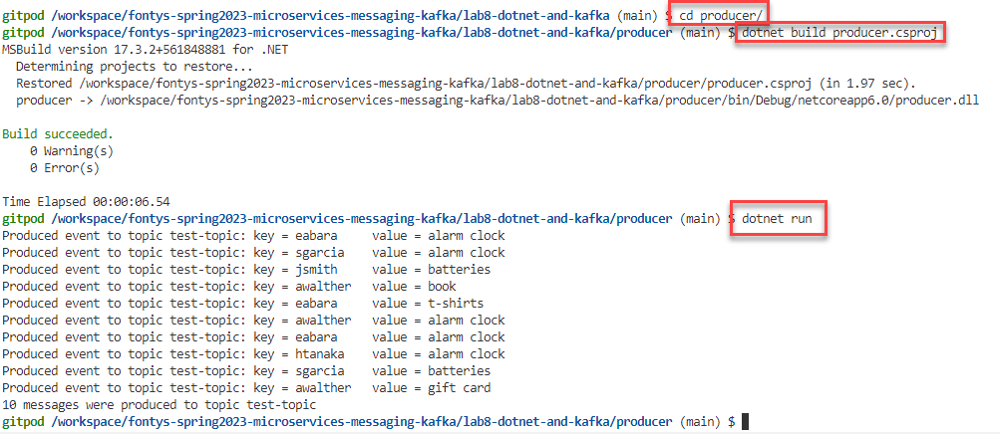
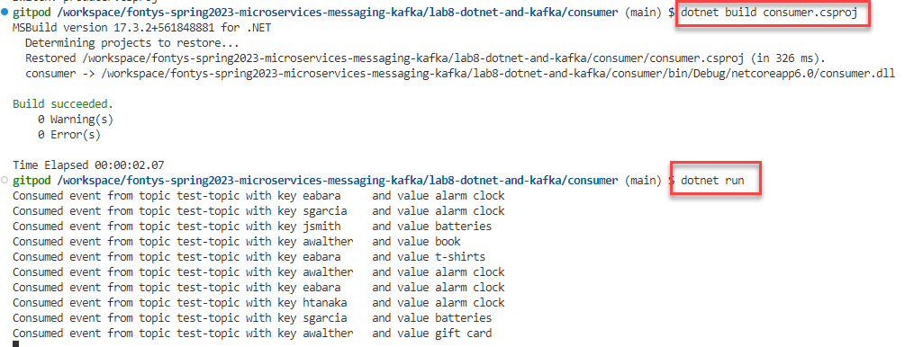

# .NET / C# and Kafka

- [.NET / C# and Kafka](#net--c-and-kafka)
  - [Producer](#producer)
  - [Consumer](#consumer)
- [resources](#resources)

In the labs 3, 5, 6 and 7, you have produced and consumed messages from Node, Python, Java and Go respectively. In this lab, you will also produce and consume messages in a programmatic way, from a .NET C# application. You will use the Apache Kafka platform that you used in earlier labs as well as the .NET Core run time environment that is also part of the Gitpod workspace.

The sources for this part of the lab are in the directory *lab8-dotnet-and-kafka*.

The most prominent .NET client library for interacting with Apache Kafka is probably Confluent's .NET Client for Apache Kafka, derived from Andreas Heider's [rdkafka-dotnet](https://github.com/ah-/rdkafka-dotnet) and a lightweight wrapper around librdkafka, a finely tuned C client. The library is distributed via NuGet. See the [GitHub Repo's readme](https://github.com/confluentinc/confluent-kafka-dotnet) for more details

## Producer

In this lab, we stick to a very simple example. In sub directory producer, you find the file `producer.csproj` that defines the application's dependencies, most notably on the Kafka Client library:

```
<ItemGroup>
    <PackageReference Include="Confluent.Kafka" Version="1.9.3" />
    ...
```

The actual producer is implemented in file `producer.cs`. It should be pretty straightforward - especially if you have worked your way through the other labs. The ProducerConfig is created with the bootstrapservers property. Using this configuration, a producer is created using the ProducerBuilder. Subsequently, messages are produced (asynchronously) to the test-topic. After all messages have been produced, the flush command is executed - creating a synchronous wait until the messages are all committed to the topic. 

To build the application, execute this command:

```
dotnet build producer.csproj
```

To actually run the producer application:

```
dotnet run
```


You can check - for example in AK HQ - if the messages are indeed produced to the *test-topic*.

## Consumer

After having seen the *producer* you will not be surprised by the *consumer*. Located in the *consumer* subdirectory, it contains a *csproj* file that defines the dependencies and file `consumer.cs` with the C# code that consumers messages from the topic. A similar configuration object is created - including the consumer group identifier and the auto.offset.reset policy. Based on the configuration, a consumer is created using the ConsumerBuilder. It is then subscribed to the *test-topic* and it starts a loop with continuous consumption (polling). 

To build the application, execute this command:

```
dotnet build consumer.csproj
```

To actually run the consumer application:

```
dotnet run
```





# resources
[Getting Started with Apache Kafka and .NET](https://developer.confluent.io/get-started/dotnet/)

[Apache Kafka for .Net Developers Course](https://developer.confluent.io/learn-kafka/apache-kafka-for-dotnet/overview/)
[GitHub Repo for Confluent's .NET Client for Apache Kafka](https://github.com/confluentinc/confluent-kafka-dotnet)